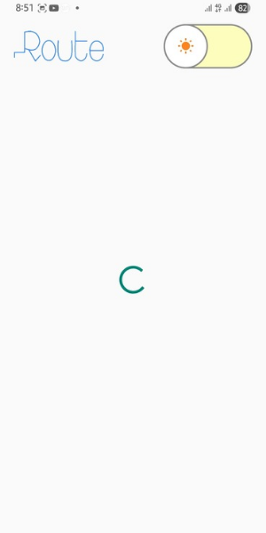

# Photo Gallery App
### Light Mode



### Dark Mode


### Offline Mode 


## Preview Video 
https://drive.google.com/file/d/1yfnoVRiSwbWZpO2FtwxEOnWHnuZZAsxY/view?usp=sharing

## Overview

Welcome to my Photo Gallery App, a sleek and functional Android application I developed to showcase curated photos from the Pexels API. My goal with this project was to create a fluid user experience, incorporating modern Android development practices and robust architecture.

This application provides users with an intuitive way to browse stunning images, offering essential features like offline support for uninterrupted viewing and a dynamic theme switcher for personalized aesthetics.

## Features

I've implemented several key features to enhance the app's functionality and user experience:

* **Curated Photo Browse:** Seamlessly explore a collection of high-quality, curated photos fetched directly from the Pexels API.
* **Dynamic Grid Layout:** Photos are displayed using a `StaggeredGridLayoutManager`, ensuring a visually appealing and adaptive layout that gracefully handles images of varying aspect ratios.
* **Infinite Scrolling (Pagination):** The app intelligently loads more photos as you scroll, providing a continuous Browse experience without manual refreshing.
* **Offline Accessibility:** Leveraging local caching, I've enabled offline support, allowing users to view previously loaded images even without an active internet connection.
* **Interactive Image Viewer:** Tapping on any photo expands it into a dedicated `Dialog` for a larger, more detailed view.
* **Network Status Indicator:** A subtle UI element notifies the user when the device goes offline, ensuring transparency about data availability.
* **Dynamic Theme Switching:** Users can effortlessly toggle between Light and Dark Modes, with their preference saved for subsequent app launches.
* **Themed Splash Screen:** The initial splash screen intelligently adapts to the user's chosen theme, providing a consistent visual experience from the very start.
* **Enhanced User Feedback:** Clear loading indicators and error messages guide the user through various states of the application.

## Architecture

I've meticulously structured this project using **Clean Architecture** principles. This approach cleanly separates concerns into distinct layers: Presentation, Domain, and Data. This modularity ensures:

* **Maintainability:** Easier to understand and modify specific parts of the codebase.
* **Scalability:** Facilitates adding new features without impacting existing functionality.
* **Testability:** Each layer can be tested independently, ensuring robustness.

Within the Presentation layer, I've adopted the **MVVM (Model-View-ViewModel)** pattern, powered by **Kotlin Flow** for reactive and asynchronous data streams between the ViewModel and the UI.

## Technologies Used

Here's a breakdown of the core technologies and libraries I've utilized in this project:

* **Kotlin:** The primary programming language, chosen for its conciseness, null-safety, and modern features.
* **AndroidX Libraries:** A comprehensive suite of Jetpack libraries providing modern UI components, architectural patterns, and utilities.
* **Hilt:** My go-to solution for robust Dependency Injection, simplifying object creation and management across the app.
* **Retrofit:** A type-safe HTTP client for gracefully handling API calls to the Pexels service.
* **Gson:** For seamless serialization and deserialization of JSON data received from the Pexels API.
* **Room Persistence Library:** Utilized for local data storage and caching, crucial for enabling the offline viewing experience.
* **Glide:** A fast and efficient image loading library, handling image fetching, caching, and display.
* **Kotlin Coroutines & Flow:** Essential for managing asynchronous operations and building reactive data pipelines, ensuring a smooth and responsive UI.
* **Material Design:** Applied for a modern, aesthetically pleasing, and consistent user interface.
* **StaggeredGridLayoutManager:** Integrated for dynamic and visually engaging grid layouts in the `RecyclerView`.

## Setup / Installation

To run this project on your local machine:

1.  **Clone the Repository:**
    ```bash
    git clone [https://github.com/YourGitHubUsername/PhotoGalleryApp.git](https://github.com/YourGitHubUsername/PhotoGalleryApp.git)
    cd PhotoGalleryApp
    ```

2.  **Obtain a Pexels API Key:**
    * Visit the [Pexels API website](https://www.pexels.com/api/) and sign up for a free API key.

3.  **Integrate the API Key:**
    * Open the `app/build.gradle.kts` file (the one in the `app` module, not the project root).
    * Locate the `buildConfigField` line:
        ```kotlin
        buildConfigField("String", "PEXELS_API_KEY", "\"YOUR_PEXELS_API_KEY_HERE\"")
        ```
    * **Replace `"YOUR_PEXELS_API_KEY_HERE"` with your actual Pexels API Key.**
        (For production apps, it's generally recommended to store API keys more securely, e.g., in `local.properties` and exclude from version control. This approach is simple for demonstration.)

4.  **Sync Gradle and Run:**
    * Open the project in Android Studio.
    * Perform a Gradle Sync.
    * Run the application on an Android emulator or a physical device.


## Contributing

I welcome contributions! If you have suggestions for improvements, feature ideas, or find any bugs, feel free to open an issue or submit a pull request.

## License

This project is licensed under the MIT License. See the [LICENSE](LICENSE) file for more details.

---
